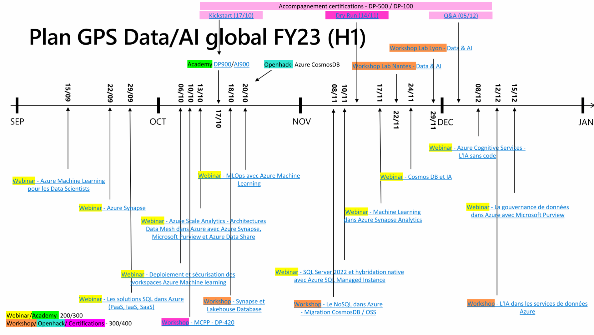

# GPS Tech FR - Data & AI team

Welcome to the Microsoft's Global Partner Success tech FR division - Data & AI repository!

We are a team of 4 Cloud Solution Architects:

Proposing a technical skilling plan focused on Azure Data & AI technologies and spanning from June 2022 to June 2023:

You can find more details about the timeline/registration [here](https://www.linkedin.com/smart-links/AQEQbKnR4QJ2Rw/c39ba816-bb8b-46f8-b6eb-f2387bf6ccc7).

## Contents

We will be sharing our plan's content in this repository (slides, demos, ...)

|Directory|Description|
|-|-|
|[`Academy`](Academy/)|Content related to Azure [AI-900](https://learn.microsoft.com/en-us/certifications/exams/ai-900): AI fundamentals & [DP-900](https://learn.microsoft.com/en-us/certifications/exams/dp-900): Data fundamentals academies.||
|[`Kickstart`](Kickstart/)|Content related to [DP-500](https://learn.microsoft.com/en-us/certifications/exams/dp-500): Designing and Implementing Enterprise-Scale Analytics Solutions Using Microsoft Azure and Microsoft Power BI & [DP-100](https://learn.microsoft.com/en-us/certifications/exams/dp-100): Designing and Implementing a Data Science Solution on Azure skilling sessions we propose.||
|[`Microhack`](Microhack/)|Content related to our CosmosDB microhack.||
|[`Webinar`](Webinar/)|Slides shared during our different webinars.||
|[`Workshop`](Workshop/)|Content related to our data & AI deep dive workshops.||

Feel free to reach out to us via our emails or linkedin to discuss further.

Happy learning!
